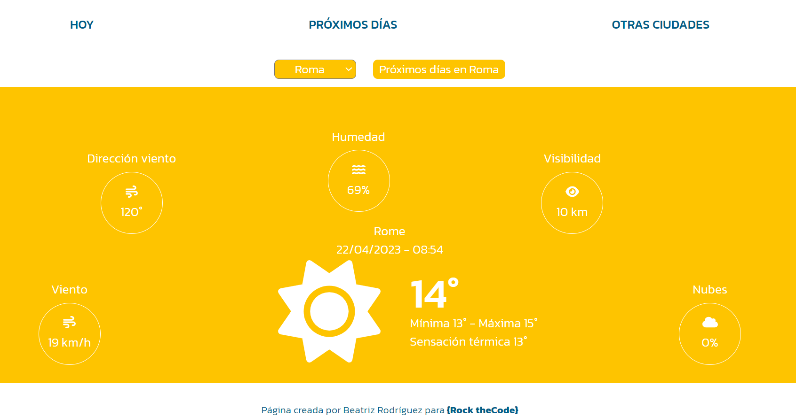
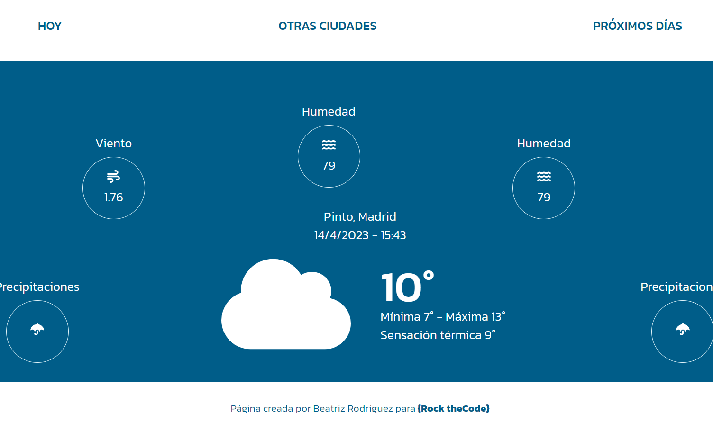
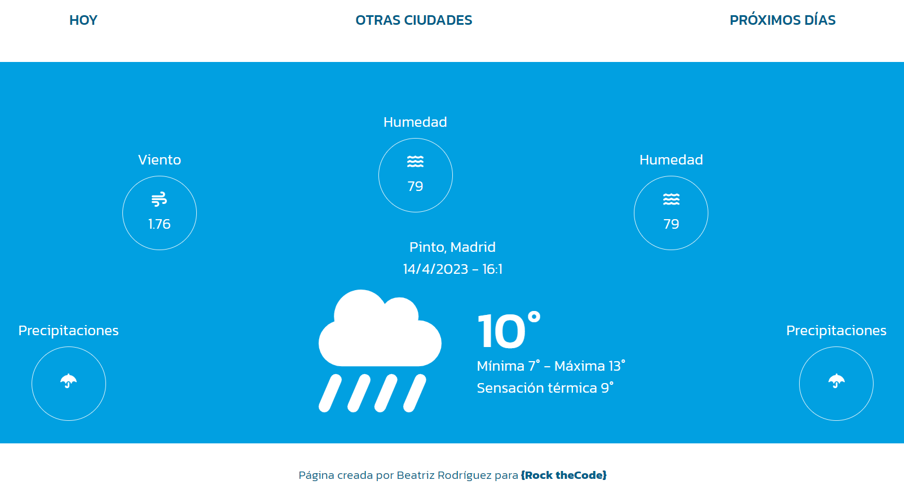
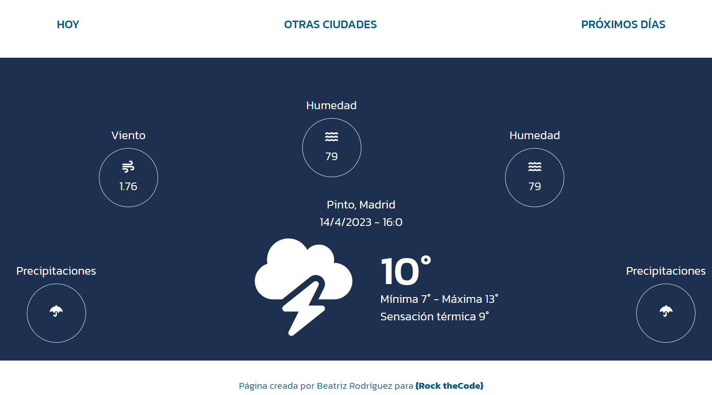
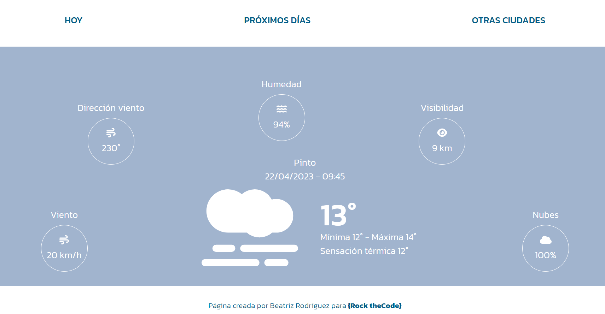
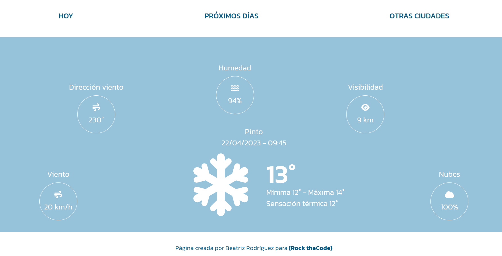

### URLs disponibles:
**Home**: https://que-tiempo-hace-hoy.netlify.app/
**NextDays**: https://que-tiempo-hace-hoy.netlify.app/proximos-dias
**ByCity**: https://que-tiempo-hace-hoy.netlify.app/otras-ciudades
**CityNextDays**: https://que-tiempo-hace-hoy.netlify.app/otras-ciudades/proximos-dias/Madrid
**NotFound**: https://que-tiempo-hace-hoy.netlify.app/pepe

### Color de fondo dinámico según el tiempo: 

